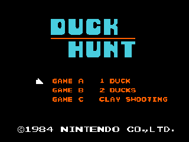
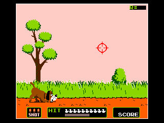
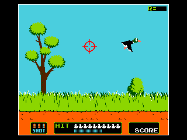
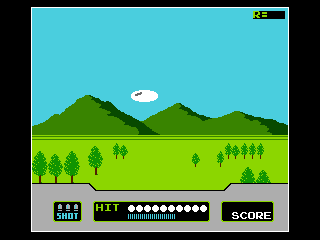

# DuckHunt 

<html>

</img>

</html>

> Duck Hunt is a classic game that has been enjoyed by generations of gamers. Now, you can experience the thrill of hunting ducks on your TI-84 Plus CE!

## Features

* Multiple game modes, including 1 Duck Shooting, 2 Duck Shooting, and Clay Shooting

* Bonus Duck types with various point amounts

* Overall high-score

* Compatible with TI-84 Plus CE calculators

## Installation

* Download and install TI-Connect CE or TILP if you don't already have connectivity software.

* Transfer to the calculator the latest C libraries to your calculator; you can find them at this link:
  https://github.com/CE-Programming/libraries/releases/latest

* Transfer the 2 files from Github release: (DUCKHUNT, DUCKSPT)

## Run

Run DuckHunt from the homescreen by pressing `[prgm]` and selecting `DUCKHUNT`,
Your screen should look like this (press Enter when it does):

    prgmDUCKHUNT

Note: If your OS is 5.5 or higher, use the arTIfiCE exploit tool to run the program: https://yvantt.github.io/arTIfiCE/.

## Controls 

    [←→↓↑]  - Move cursor 
    [2nd]   - Shoot bullet
    [mode]  - Pause game
    [del]   - Quit to homescreen

## Concepts Images

 

 

## Development
Current State:

| GAME A                                            | GAME B                                            | GAME C                                            |
| ------------------------------------------------- | ------------------------------------------------- | ------------------------------------------------- |
|  |  |  |

> *Keep up to date on the recent development by checking out the [New Discord Server](https://discord.gg/xyUZgnD4UJ "New Discord Server") or on [Cemetech Forums](https://www.cemetech.net/forum/viewtopic.php?t=15070 "Cemetech Forums"). You can also view the [Trello Board](https://trello.com/b/NkkezsJu/duckhunt-development-c) For more information about the development.*

## Credit

* DuckHunt was written from scratch based off of NES Duck Hunt mechanics. 

* Images/Sprites are copyright of Nintendo.

* DuckHunt is an independent game that is not affiliated with Nintendo. It is a humble attempt to recreate a classic and beloved game.

------------

 Copyright &copy; 2021 - 2023, ***Alvajoy123***
